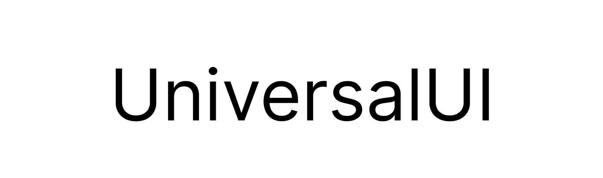

  

the ultimate application framework

<h2>Brief</h2>

to produce applications that:

- are perfectly cross-platform
- are extremely efficient
- are highly customisable
- are beautifully designed

 

<h2>Target Platforms</h2>

- Linux (using GTK)
- Windows (min. 10)
- MacOS (min. 10.12)
- iOS & iPadOS (min. 13.0)
- Android (min. 8.0 Oreo)
- Web (using WebAssembly & WebGL)

 

<h2>Intended Use Cases</h2>

Many, including:

- 3D applications
- Creative and production software
- Cross-platform tools
- Embedded systems and portable devices
- Enterprise and industrial software
- Porting existing C++ frameworks to other platforms

 

<h2>Why use UniversalUI?</h2>

UniversalUI won't be perfect for every project but here are some reasons to consider it for yours:

- all the aspects of the brief mentioned above
- quick design for rapid prototyping
- easy to use framework
- native support for all major platforms
- develop for one and support all the others with ease!

 

<h2>Licence - MIT License</h2>

Copyright (c) 2023 Sebastian Hall

Permission is hereby granted, free of charge, to any person obtaining a copy
of this software and associated documentation files (the "Software"), to deal
in the Software without restriction, including without limitation the rights
to use, copy, modify, merge, publish, distribute, sublicense, and/or sell
copies of the Software, and to permit persons to whom the Software is
furnished to do so, subject to the following conditions:

The above copyright notice and this permission notice shall be included in all
copies or substantial portions of the Software.

THE SOFTWARE IS PROVIDED "AS IS", WITHOUT WARRANTY OF ANY KIND, EXPRESS OR
IMPLIED, INCLUDING BUT NOT LIMITED TO THE WARRANTIES OF MERCHANTABILITY,
FITNESS FOR A PARTICULAR PURPOSE AND NONINFRINGEMENT. IN NO EVENT SHALL THE
AUTHORS OR COPYRIGHT HOLDERS BE LIABLE FOR ANY CLAIM, DAMAGES OR OTHER
LIABILITY, WHETHER IN AN ACTION OF CONTRACT, TORT OR OTHERWISE, ARISING FROM,
OUT OF OR IN CONNECTION WITH THE SOFTWARE OR THE USE OR OTHER DEALINGS IN THE
SOFTWARE.
